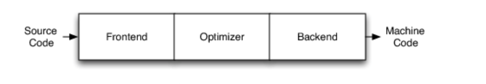
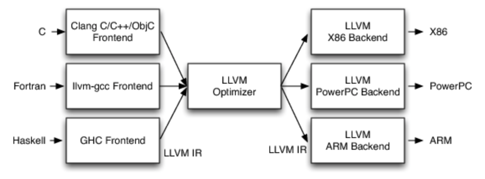

# LLVM

## LLVM工具

### llvm-as将人类可读的.ll文件汇编成字节代码
### llvm-dis将字节代码反汇编成可读的.ll文件
### opt在一个字节代码文件上优化
### llc为字节代码生成本机代码 //重要

## LLVM结构
传统编译器的结构是三层：前端、优化、后端

LLVM设计则是

这样的优点是需要新建编程语言改变前端，需要硬件设备就改变后端，不需要对优化部分修改

[reference](https://releases.llvm.org/1.3/docs/BytecodeFormat.html)